<h3><code>sayan@github ~ $ ./contributions.sh</code></h3>

  

<h3><code>sayan@github ~ $ whoami</code></h3>

<table>
  <tr>
    <td valign="top">
      
    </td>
    <td valign="top">
      
    </td>
  </tr>
</table>

 

  <a href="https://sayan-pal.vercel.app/">Portfolio</a>
  ·
  <a href="https://www.linkedin.com/in/sayanpal04">LinkedIn</a>
  ·
  <a href="https://www.instagram.com/_sayan_003._">Instagram</a>

