<h3><code>sayan@github ~ $ ./contributions.sh</code></h3>

  

<h3><code>sayan@github ~ $ whoami</code></h3>

<table>
  <tr>
    <td valign="top">
      
    </td>
    <td valign="top">
      
    </td>
  </tr>
</table>

  

<h3><code>sayan@github ~ $ ./links.sh</code></h3>

  <strong>AI/ML Developer · Software Developer · MCA @ KIIT</strong>

  

  

  

  

